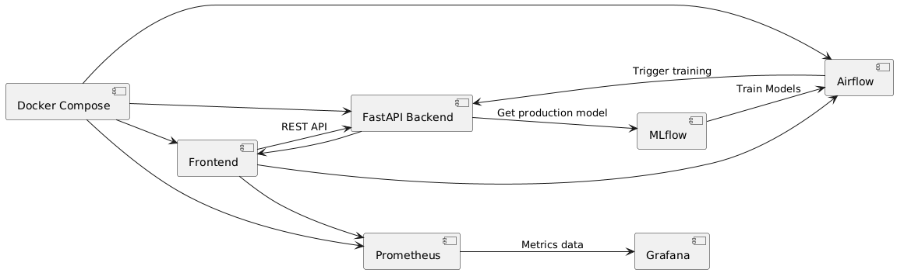

# Turbofan RUL Prediction System Design

## 1. Architectural Paradigm
- **Backend**: Functional programming pattern (stateless FastAPI routes)
- **Frontend**: Component-based UI (vanilla JS modules)

## 2. High-Level Design (HLD)

## 3. Low-Level Design (LLD)
### API Specifications
| Endpoint       | Method | Input (JSON)                          | Output (JSON)                          |
|----------------|--------|----------------------------------------|-----------------------------------------|
| `/api/predict` | POST   | `{engine_id: int, settings: [3], sensors: [21]}` | `{rul: float, confidence: {lower: float, upper: float}}` |
| `/api/health`  | GET    | -                                      | `{status: "OK", version: "1.0.0"}`      |
